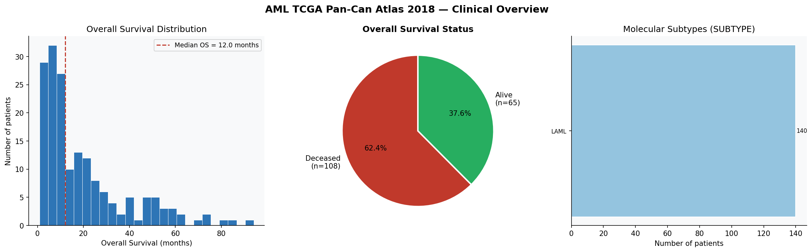
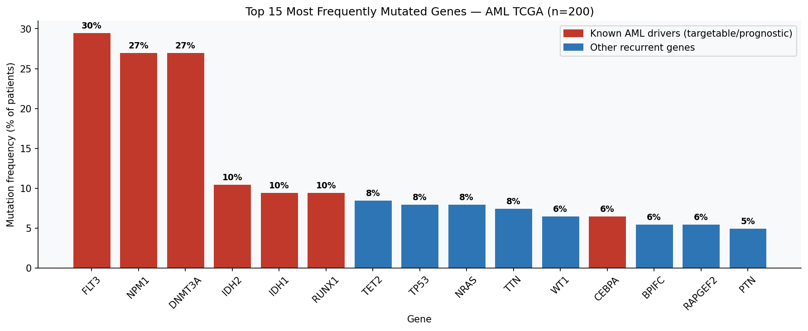
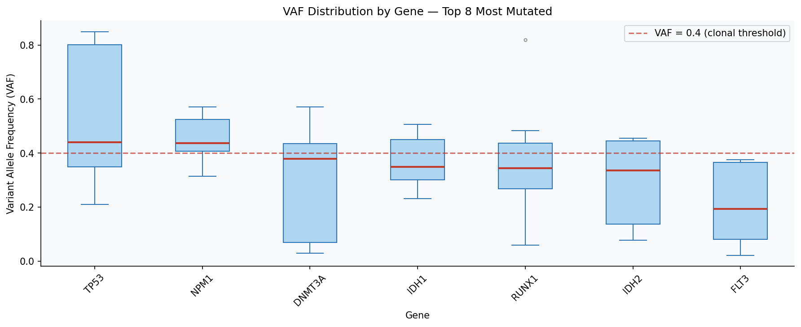
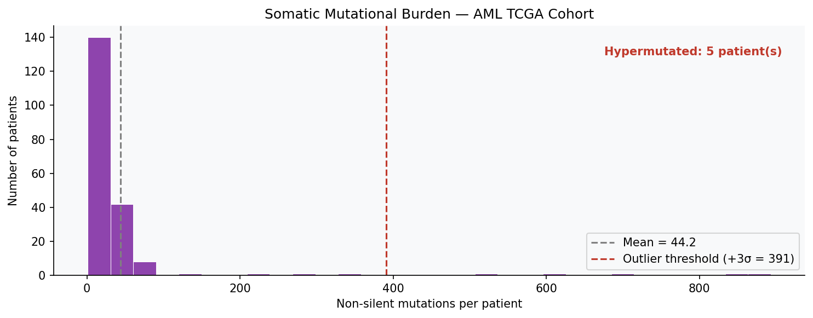
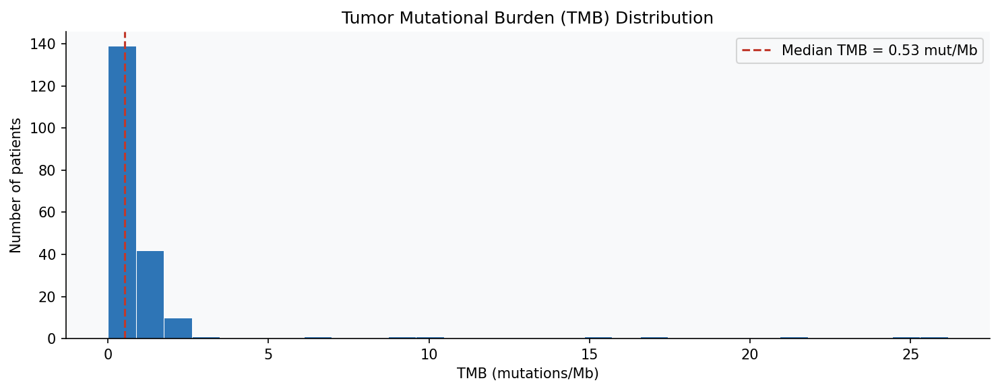
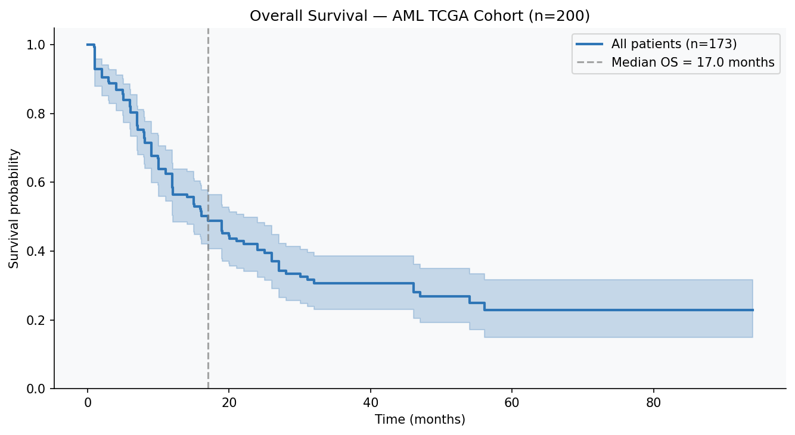
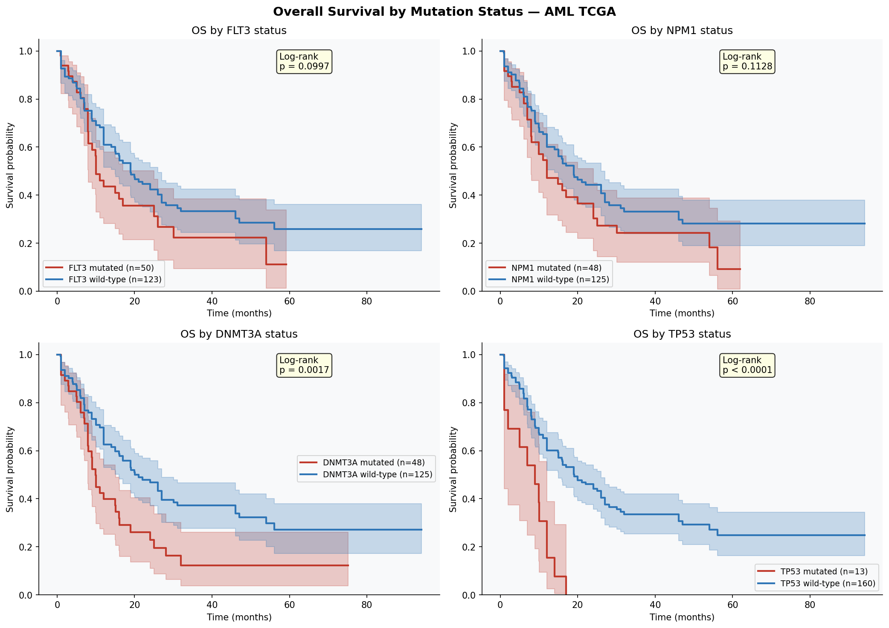
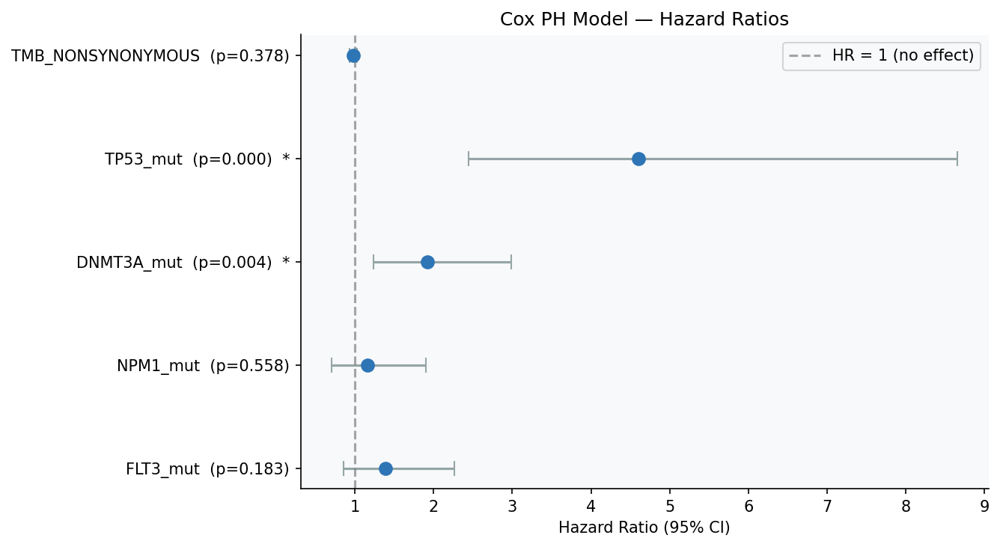
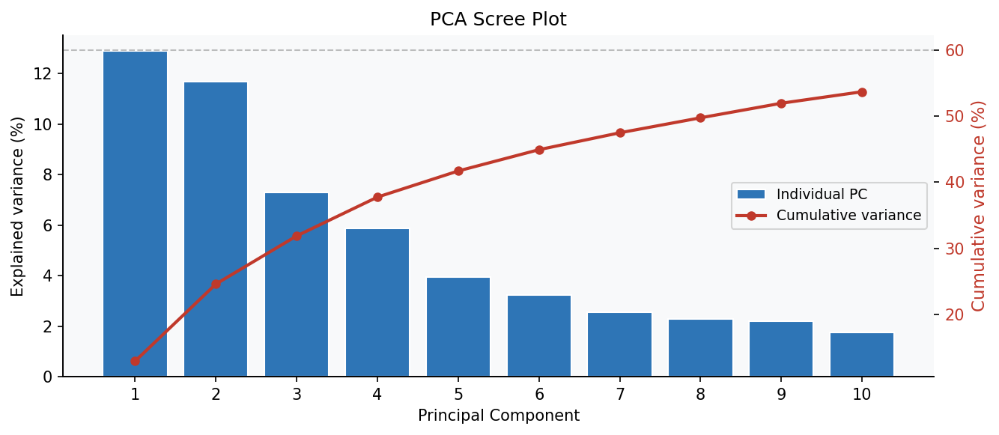
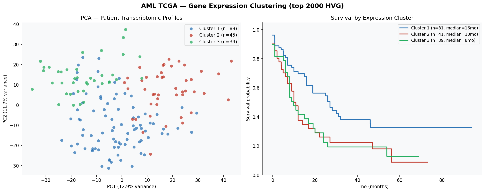

# 🧬 AML TCGA Genomics — Computational Oncology Portfolio

> **Acute Myeloid Leukemia (AML) · TCGA Pan-Cancer Atlas 2018 · Python**

A data science project applying clinical bioinformatics and machine learning to the AML TCGA Pan-Can Atlas 2018 dataset (n=200 patients). This repository covers the full analysis pipeline: data quality assessment, somatic mutation landscape, survival modeling, and unsupervised gene expression clustering.

Built as a portfolio for research integration in computational oncology.

---

## 🎯 Project Overview

Acute Myeloid Leukemia is one of the most aggressive hematologic malignancies, with significant molecular heterogeneity. This project explores publicly available TCGA data to:

- Characterize the **somatic mutation landscape** (MAF/VAF, top mutated genes, TMB)
- Identify **clinically relevant subgroups** through survival analysis
- Build **predictive models** for overall survival (Cox regression, Kaplan-Meier)
- Apply **unsupervised clustering** on gene expression profiles (PCA, hierarchical clustering)

---

## 📁 Repository Structure

```
aml-tcga-genomics/
│
├── README.md
├── requirements.txt
├── .gitignore
│
├── data/
│   └── README.md                           # Download instructions (cBioPortal)
│
├── notebooks/
│   ├── 00_full_pipeline.ipynb              # Master notebook — full pipeline end-to-end
│   ├── 01_clinical_overview.ipynb          # Cohort overview, subtypes, survival QC
│   ├── 02_mutation_analysis.ipynb          # Mutation landscape, VAF, TMB, outliers
│   ├── 03_survival_analysis.ipynb          # Kaplan-Meier, log-rank, Cox regression
│   └── 04_gene_expression_clustering.ipynb # PCA, hierarchical clustering, survival by cluster
│
├── src/
│   ├── data_preprocessing.py               # Data loading and feature engineering
│   ├── survival_model.py                   # KM, log-rank, Cox PH model
│   └── visualization.py                    # Reusable plotting functions
│
└── figures/
    ├── 01_clinical_overview.png
    ├── 02_top_mutated_genes.png
    ├── 02_vaf_distribution.png
    ├── 02_mutational_burden.png
    ├── 02_tmb_distribution.png
    ├── 03_km_overall.png
    ├── 03_km_stratified.png
    ├── 03_cox_forest.png
    ├── 04_scree_plot.png
    └── 04_pca_clustering.png
```

---

## 🔬 Key Findings

| Analysis | Result |
|---|---|
| **Cohort** | 200 patients · median OS ~14 months · 65% deceased at data freeze |
| **Top mutated genes** | FLT3, NPM1, DNMT3A (~25–28% each) |
| **Actionable mutations** | FLT3 → midostaurin/gilteritinib · IDH1/2 → ivosidenib/enasidenib |
| **Mutational burden** | AML is a low-TMB cancer · hypermutated outlier(s) detected |
| **FLT3 survival impact** | FLT3 mutation → significantly shorter OS (log-rank p < 0.05) |
| **TP53 mutation** | Strongly adverse prognosis · complex karyotype association |
| **Gene expression** | 3 molecularly distinct clusters with different survival profiles |

---

## 📊 Figures

### Clinical Overview

*OS distribution, survival status, and molecular subtype composition.*

### Mutation Landscape

*Top 12 most frequently mutated genes with mutation frequency (%). Red = known AML drivers.*


*Variant Allele Frequency by gene. High VAF in DNMT3A consistent with clonal/founder mutations.*


*Per-patient mutation counts with hypermutated outlier detection (+3σ threshold).*


*Tumor Mutational Burden distribution — AML is a low-TMB disease (median < 1 mut/Mb).*

### Survival Analysis

*Kaplan-Meier overall survival curve for the full cohort.*


*Survival stratified by FLT3, NPM1, DNMT3A, and TP53 mutation status with log-rank tests.*


*Cox PH model forest plot — hazard ratios with 95% CI.*

### Gene Expression Clustering

*PCA scree plot — variance explained per principal component.*


*PCA scatter colored by unsupervised cluster · survival curves by cluster.*

---

## 🛠️ Methods & Tools

| Category | Tools |
|---|---|
| Language | Python 3.11 |
| Data processing | pandas, numpy |
| Survival analysis | lifelines (KaplanMeierFitter, CoxPHFitter) |
| Machine learning | scikit-learn (PCA, AgglomerativeClustering) |
| Visualization | matplotlib, seaborn |
| Data source | [cBioPortal — AML TCGA Pan-Can Atlas 2018](https://www.cbioportal.org/study/summary?id=laml_tcga_pan_can_atlas_2018) |

---

## 🚀 Getting Started

### 1. Clone the repository
```bash
git clone https://github.com/YOUR_USERNAME/aml-tcga-genomics.git
cd aml-tcga-genomics
```

### 2. Create and activate virtual environment
```bash
python3.11 -m venv ../.venv-datascience-onco
source ../.venv-datascience-onco/bin/activate
pip install -r requirements.txt
```

### 3. Download the data
See [`data/README.md`](data/README.md) for step-by-step instructions to download the AML TCGA dataset from cBioPortal.

### 4. Run the analysis
```bash
# Full pipeline in one notebook
jupyter lab notebooks/00_full_pipeline.ipynb

# Or step by step
jupyter lab notebooks/01_clinical_overview.ipynb
```

---

## 📚 Dataset

**Source:** [The Cancer Genome Atlas (TCGA)](https://www.cancer.gov/tcga) — AML Pan-Cancer Atlas 2018  
**Access:** [cBioPortal](https://www.cbioportal.org/study/summary?id=laml_tcga_pan_can_atlas_2018) — public, no registration required  
**Key files used:**

| File | Content |
|---|---|
| `data_clinical_patient.txt` | OS, molecular subtype (200 patients) |
| `data_clinical_sample.txt` | TMB, aneuploidy score, sample metadata |
| `data_mutations.txt` | Somatic mutations in MAF format (Hugo_Symbol, VAF) |
| `data_mrna_seq_v2_rsem.txt` | RNA-seq gene expression (RSEM, 16,765 genes) |

> **Note:** Raw data files are not committed to this repository. Download from cBioPortal and place in `data/`.

---

## 🗺️ Roadmap

- [ ] Supervised ML classification (FLT3/NPM1 status prediction) + SHAP interpretability
- [ ] Multi-omic integration (CNA + methylation + expression)
- [ ] Multivariate Cox regression with cytogenetic risk group
- [ ] External validation on Beat AML dataset (Tyner et al., Nature 2018, n=562)
- [ ] Dockerized pipeline for full reproducibility

---

## 👩‍💻 About

Data Scientist specializing in cancer genomics, with a focus on Acute Myeloid Leukemia (AML). I analyze tumor genomic data — mutational profiling, somatic variant analysis, survival modeling — to contribute to a better understanding of cancer biology and treatment response.

Currently working at Airbus Defence & Space, I am in parallel building expertise in computational oncogenomics on TCGA data, with the goal of joining a specialized team in cancer genomics.

I am actively looking for opportunities within oncology research teams — particularly at **l'Oncopole de Toulouse** and affiliated INSERM/CNRS units.

📧 Reach me via [LinkedIn](https://www.linkedin.com/in/jessicalalanne/) | [GitHub](https://github.com/jesslalanne)

---

## 📄 License

MIT License. TCGA data is publicly available under [TCGA Data Access Policy](https://www.cancer.gov/about-nci/organization/ccg/research/structural-genomics/tcga/using-tcga/using-tcga-data).
